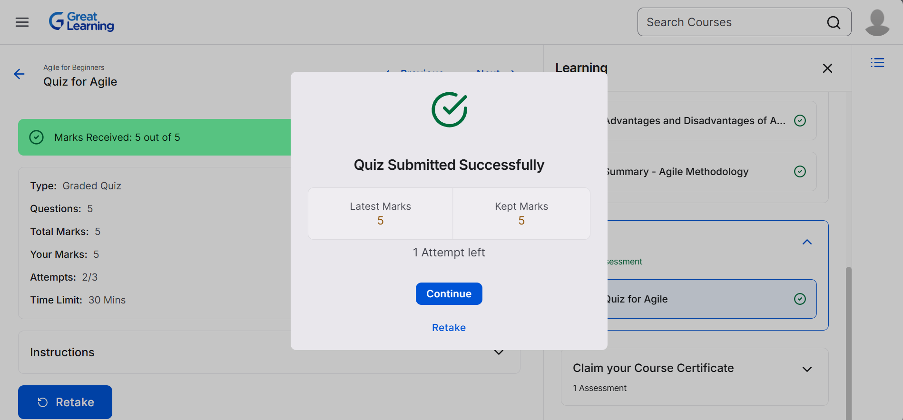
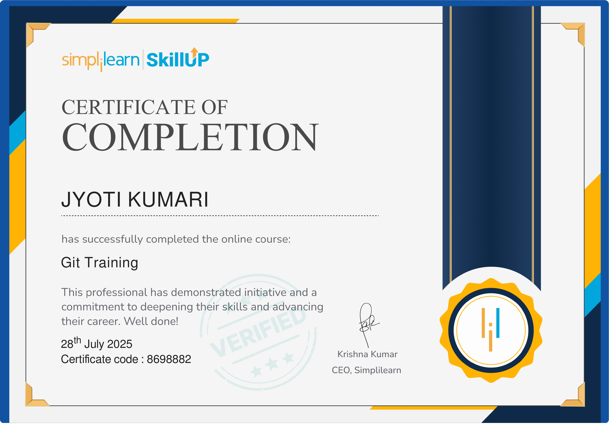

# 5075475_JYOTI

# Weekly Assignment Screenshot(Completion Certificate) Submission

This repository contains screenshot or Completion Certificate of Weekly Assignments submitted as a part of the " LTTS StepIn Program "

## week 1 - Agile For Beginners - Great Training

## week 2 - Collaboration and Source code management with Git

## week 3 - Basic of Linux Commands
- [Linux History (PDF)](LINUX/linux_history1.pdf)
